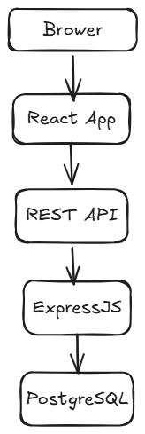

# TÀI LIỆU PHÂN TÍCH YÊU CẦU (REQUIREMENT)
## Dự án: Hệ thống quản lý công việc cá nhân (Task Management System)

---

## 1. MỤC TIÊU DỰ ÁN
Xây dựng một ứng dụng web (Web Application) cho phép người dùng cá nhân có thể đăng ký tài khoản, đăng nhập bảo mật và quản lý các công việc cần làm hàng ngày một cách khoa học.

---

## 2. PHẠM VI CHỨC NĂNG (SCOPE)

### 2.1. Xác thực người dùng (Authentication)
*   Đăng ký tài khoản mới (Register)
*   Đăng nhập vào hệ thống (Login)
*   Đăng xuất (Logout)

### 2.2. Quản lý công việc (Task CRUD & Complete)
*   Tạo công việc mới (Create Task)
*   Xem danh sách công việc (Read Tasks)
*   Chỉnh sửa nội dung công việc (Update Task)
*   Xóa công việc (Delete Task)
*   Đánh dấu hoàn thành/chưa hoàn thành công việc (Toggle Complete)

---

## 3. CÂU CHUYỆN NGƯỜI DÙNG (USER STORIES)

### User Story 1: Đăng ký tài khoản
*   **Là một:** Người dùng mới chưa có tài khoản.
*   **Tôi muốn:** Nhập Email, Mật khẩu và Họ tên để đăng ký tài khoản.
*   **Để:** Tôi có thể bắt đầu sử dụng hệ thống bảo mật của riêng mình.
*   **Tiêu chí nghiệm thu (Acceptance Criteria):**
    *   Hệ thống phải kiểm tra xem Email đã tồn tại hay chưa. Nếu trùng phải báo lỗi.
    *   Mật khẩu nhập vào phải được mã hóa trước khi lưu vào database.

### User Story 2: Đăng nhập hệ thống
*   **Là một:** Người dùng đã có tài khoản.
*   **Tôi muốn:** Điền Email và Mật khẩu chính xác để đăng nhập.
*   **Để:** Truy cập vào danh sách công việc cá nhân được bảo mật của tôi.
*   **Tiêu chí nghiệm thu:**
    *   Nếu sai Email hoặc Mật khẩu, hệ thống phải hiển thị thông báo lỗi rõ ràng.
    *   Khi đăng nhập thành công, hệ thống cấp một mã định danh (JWT Token) để giữ phiên đăng nhập.

### User Story 3: Tạo công việc mới (Create Task)
*   **Là một:** Người dùng đã đăng nhập.
*   **Tôi muốn:** Nhập Tiêu đề (Title) và Mô tả (Description) để tạo một task mới.
*   **Để:** Tôi ghi lại những việc cần làm, tránh bị quên.
*   **Tiêu chí nghiệm thu:**
    *   Tiêu đề công việc là bắt buộc (không được để trống).
    *   Trạng thái mặc định của task mới tạo luôn là "Chưa hoàn thành" (Pending/Incomplete).

### User Story 4: Xem danh sách công việc (Read Tasks)
*   **Là một:** Người dùng đã đăng nhập.
*   **Tôi muốn:** Nhìn thấy toàn bộ danh sách các công việc tôi đã tạo trên màn hình chính.
*   **Để:** Tôi biết hôm nay mình có những việc gì cần giải quyết.
*   **Tiêu chí nghiệm thu:**
    *   Người dùng A chỉ được nhìn thấy công việc của người dùng A, tuyệt đối không được nhìn thấy công việc của người dùng B.

### User Story 5: Chỉnh sửa công việc (Edit/Update Task)
*   **Là một:** Người dùng đã đăng nhập.
*   **Tôi muốn:** Click vào nút Sửa để thay đổi Tiêu đề hoặc Mô tả của một task hiện tại.
*   **Để:** Cập nhật lại thông tin khi công việc có sự thay đổi kế hoạch.
*   **Tiêu chí nghiệm thu:**
    *   Hệ thống lưu lại thay đổi mới nhất và cập nhật ngay trên màn hình.

### User Story 6: Hoàn thành công việc (Complete Task)
*   **Là một:** Người dùng đã đăng nhập.
*   **Tôi muốn:** Tích chọn (Check) vào một ô vuông bên cạnh công việc.
*   **Để:** Đánh dấu rằng tôi đã làm xong việc đó (Hệ thống có thể gạch ngang chữ để phân biệt).
*   **Tiêu chí nghiệm thu:**
    *   Trạng thái của task chuyển từ "Chưa hoàn thành" sang "Đã hoàn thành". Người dùng có thể bỏ tích để chuyển ngược lại nếu muốn.

### User Story 7: Xóa công việc (Delete Task)
*   **Là một:** Người dùng đã đăng nhập.
*   **Tôi muốn:** Nhấn vào nút "Xóa" (biểu tượng thùng rác) ở một công việc.
*   **Để:** Loại bỏ hoàn toàn công việc đó ra khỏi danh sách nếu nó không còn cần thiết.
*   **Tiêu chí nghiệm thu:**
    *   Hệ thống nên hiển thị một hộp thoại xác nhận (Confirm) "Bạn có chắc chắn muốn xóa không?" trước khi xóa hẳn để tránh người dùng bấm nhầm.

